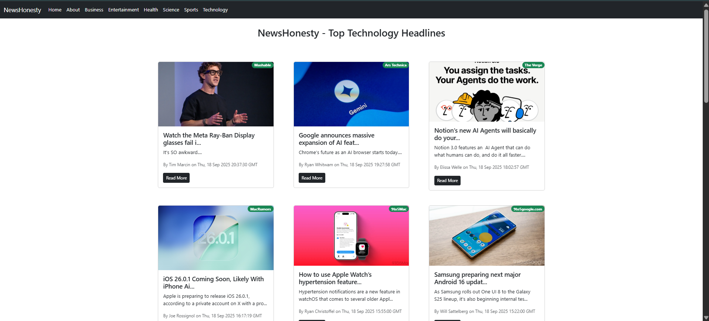

# 📰 News-Honesty

<!-- <a href="https://mayankflix.netlify.app/">Live Demo</a> -->

<div>


</div>


# It uses the [NewsAPI](https://newsapi.org) to fetch real-time news data.
**news-Honesty** is a modern React-based news web application that provides the **top and latest news** from different categories such as **Business, Technology, Health, Entertainment, General, Science, and Sports**.

---

## ✨ Features

- Browse **top headlines** across multiple categories
- Read **latest updates** in Business, Technology, Health, Sports, etc.
- Responsive UI built with **React + Bootstrap**
- Each article shows:
  - Title & short description
  - Thumbnail image (with fallback)
  - Author & published date
  - News source badge
- "Read More" button to open full article in a new tab

---

## 🛠️ Tech Stack

- **React** (Functional Components + Hooks)
- **React Router** for navigation
- **Bootstrap** for styling
- **NewsAPI** for live data
- **ESLint** for clean code practices

---

## ⚙️ Installation & Setup
## Setup Guide

1. Install the Dependencies
    ```bash 
    npm install 
    ```
2. Rename: Generate your API key from nevsapi.org[NewsAPI](https://newsapi.org) and save it to [.env.local]file. after run project

3. Run the Application
    ```bash
    npm start
    ```

```
